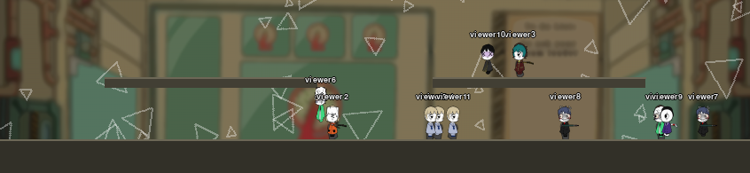

# LobCorp Twitch Playground

A standalone [pygame-ce](https://pyga.me/) scene where each Twitch viewer who chats
becomes a little *Lobotomy Corporation*-style employee. Viewers `!join` to spawn a
character bound to their username, then drive it from chat — `!hug`, `!follow`,
`!leave`, `!panic`, `!cheer`. The characters wander a sidescroller world with real
gravity, jump between platform tiers, steer around each other as a crowd, form
follow-clusters, and carry a continuous emotional state that spreads by contagion
through the crowd.

The window is designed to be captured by OBS/Streamlabs as a window-capture source
and dropped into a stream layout. It runs **with no Twitch credentials** in a
keyboard-driven dev mode, so you can iterate on the simulation offline.

---

## Requirements

- **Python 3.10** (the project pins `>=3.10,<3.11`)
- [`uv`](https://docs.astral.sh/uv/) for dependency management (recommended)

Core dependencies (installed automatically): `pygame-ce`, `twitchio` (2.x),
`python-dotenv`, `Pillow`, `numpy`, `scipy`.

---

## Quick start

```bash
# install dependencies into a managed virtualenv
uv sync

# run — starts in dev mode if no Twitch credentials are configured
uv run playground
```

By default the app falls back to **dev mode**: no Twitch connection, characters are
spawned and driven from the keyboard (see [Dev mode](#dev-mode-no-twitch-needed)).

---

## Connecting to Twitch

The app reads three values from a `.env` file in the project root: the channel to
join, an OAuth **access token**, and a **refresh token**. You generate the token pair
through [twitchtokengenerator.com](https://twitchtokengenerator.com), supplying it
with **your own Twitch app credentials** (a client id/secret you register once at
[dev.twitch.tv](https://dev.twitch.tv/console/apps/)). The generator then holds those
credentials and brokers token refreshes for you, so the running app itself never
needs the client secret.

### 1. Create the `.env` file

```bash
cp .env.example .env
```

```ini
# .env
TWITCH_CHANNEL=your_channel_name_here
TWITCH_ACCESS_TOKEN=your_access_token_here
TWITCH_REFRESH_TOKEN=your_refresh_token_here
```

- **`TWITCH_CHANNEL`** — the channel whose chat to read (usually your own channel
  name, lowercase).

### 2. Register a Twitch application

1. Go to the [Twitch developer console → Applications](https://dev.twitch.tv/console/apps/)
   and click **Register Your Application**.
2. Set the **OAuth Redirect URL** to twitchtokengenerator's callback —
   `https://twitchtokengenerator.com/` (use whatever redirect URL twitchtokengenerator
   tells you to register for its custom-token flow).
3. Pick any category, create the app, then copy its **Client ID** and generate a
   **Client Secret**. Keep these private — they stay with the generator, not in this
   repo's `.env`.

### 3. Generate the token pair

1. Go to [twitchtokengenerator.com](https://twitchtokengenerator.com) and choose the
   option to **use your own client id / secret** (custom token), then paste in the
   Client ID and Client Secret from the previous step.
2. Select the **`chat:read`** scope — that is all the app needs to read chat. (Add
   `chat:edit` only if you later want the bot to *send* messages; it does not today.)
3. Authorize with the Twitch account you want the bot to read chat as.
4. The generator returns **two** values: an **ACCESS TOKEN** and a **REFRESH TOKEN**.
   Copy each into the matching variable in `.env`.

> Paste the **bare** token. An `oauth:` prefix (the IRC form) is tolerated and
> stripped automatically, so either works.

### 4. Run

```bash
uv run playground
```

When a usable token **and** a channel are present, the Twitch listener starts on a
daemon thread and chat commands flow into the scene. You'll see `[twitch] connected
as <nick>` in the console. If either is missing or the token can't be made valid, the
app prints a notice and falls back to [dev mode](#dev-mode-no-twitch-needed) instead
of crashing.

### How token refresh works (automatic)

Twitch user access tokens expire, so the app manages the lifecycle for you on every
startup (see [`chat/auth.py`](twitch_playground/chat/auth.py)):

1. **Validate** the stored access token against Twitch's `/oauth2/validate`.
2. If it's **live and healthy**, use it as-is.
3. If it's **live but expiring within the hour** (`REFRESH_MARGIN = 3600s`), refresh
   *early*, but fall back to the still-valid token if the refresh fails.
4. If it's **expired/invalid**, exchange the **refresh token** for a fresh pair via
   twitchtokengenerator's proxy endpoint (no client secret needed on your side).
5. On any successful refresh, the new `(access, refresh)` pair is **written back to
   `.env`** (and into the live process env) so it persists across restarts. Refresh
   tokens can rotate, so the refresh token may change too — that's expected and
   handled.

If there is no refresh token and the access token is dead, the app can't recover the
session and drops to dev mode — regenerate the pair from twitchtokengenerator and
paste them in again.

> **twitchio version:** pinned to `>=2.10,<3`. The 3.x line reworked the API and auth
> model (app client id/secret, EventSub-oriented); a bare `pip install twitchio`
> pulls the latest, so keep the pin for the simple token flow above to work.

---

## Chat commands

| Command | Effect |
|---|---|
| `!join` | Spawn a character bound to your username. If already present, resets the idle timer and pulls you out of any cluster. Rejected with *"Organization not hiring."* when the org is at its `MAX_CHARACTERS` cap. |
| `!hug @user` | One-shot hug emote played on both you and the target, with a positive emotion nudge. |
| `!follow @user` | Leave WANDER, walk to the target's cluster, and stand idle beside them. |
| `!leave` | Leave any cluster and return to WANDER. |
| `!panic [@user]` | Spike a character's arousal and drop its valence (fear). Targets you if no `@user` given; spreads to neighbours via contagion. |
| `!cheer [@user]` | Raise a character's valence and arousal (joy). Targets you if no `@user` given; spreads to neighbours. |

Targeting: a leading `@` is stripped and the name lowercased. Self-targeting and
commands against an absent user are no-ops. You must `!join` before any other
command takes effect on you.

---

## Dev mode (no Twitch needed)

Run `uv run playground` without credentials and drive the scene from the keyboard.
Keypresses produce the exact same command objects a real viewer would, so the
simulation cannot tell the difference:

| Key | Action |
|---|---|
| `J` | A new fake viewer joins |
| `H` | A random viewer hugs another |
| `F` | A random viewer follows another |
| `L` | A random viewer leaves their cluster |
| `K` | Fill the org to the `MAX_CHARACTERS` cap (so the next `J` shows the denial) |
| `` ` `` | Toggle the debug HUD overlay |
| `Esc` | Quit |

The OS window is resizable; the fixed-size stage is aspect-preserved and letterboxed
to fit.

---

## How it works

The simulation is built as a stack of layers, each one a thin addition on top of the
last (the brain is `sim/world.py`, one character is `sim/character.py`):

- **Movement (L3)** — Reynolds-style steering: a coherent 1-D wander, horizontal
  separation, wall bounce, gravity, and jumps between one-way platform tiers.
- **Crowd awareness** — boids separation/cohesion/alignment plus a local-density
  response, so a packed platform shuffles instead of marching. All neighbour
  queries run off a single per-frame [1-D bucket grid](twitch_playground/sim/world.py)
  for near-`O(N)` cost.
- **Personality (L4)** — per-character traits derived deterministically from the
  username drive an optional autonomous join/leave utility check, layered on top of
  the command-driven grouping.
- **Emotion (L5)** — a continuous `(valence, arousal)` state per character, updated
  from decay-toward-neutral, proximity contagion, and a crowding bump, then quantized
  to faces with hysteresis. It modulates movement (speed, restlessness, spacing).

Art is composited at runtime from the vendored Lobotomy Corporation employee
sprite-part sheets ([`assets/sprites/`](twitch_playground/assets/sprites/)) behind a
clean [`AssetProvider`](twitch_playground/assets/provider.py) seam — if the sheets
are missing, it degrades to procedural placeholder sprites so the app runs anywhere.
Point `LOBCORP_ASSETS_ROOT` at a fuller sprite drop to add characters.

### Project layout

```text
twitch_playground/
  main.py            # clock, event loop, command-queue drain, despawn tick
  settings.py        # flat module-level tuning constants (heavily commented)
  dev.py             # keyboard command injector + asset-provider selection
  chat/              # twitchio bot, token auth/refresh, command parsing
  sim/               # character, world, steering, platforms, personality
  render/            # background, scene y-sort draw pass, debug HUD
  assets/            # sprite extraction + compositing, provider interface
tests/               # pytest suite for the sim and asset layers
docs/, research/     # design contracts and research briefs
```

---

## Configuration

Nearly every behaviour is a constant in
[`twitch_playground/settings.py`](twitch_playground/settings.py) — screen/stage size,
FPS (a deliberate low-fps stop-motion look), movement physics, crowd weights,
personality knobs, emotion rates, the despawn timeout, and the `MAX_CHARACTERS` cap.
The file is thoroughly commented; tune by eye and override in tests by reassigning.

---

## Tests

```bash
uv run pytest
```

The suite covers the simulation (characters, steering, platforms, personality,
emotion, world) and the asset/sprite-extraction layers. It runs headless — no display
or Twitch connection required.
